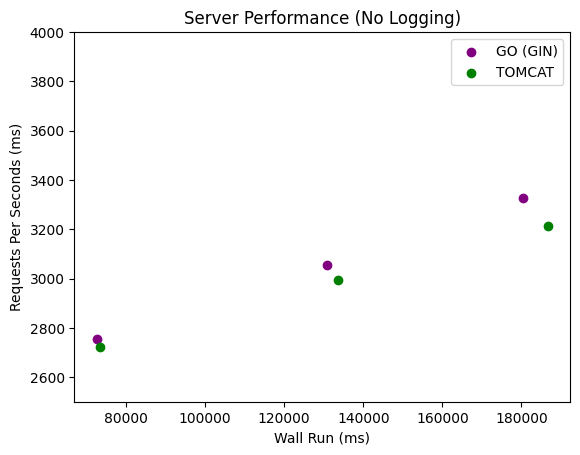
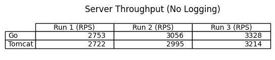
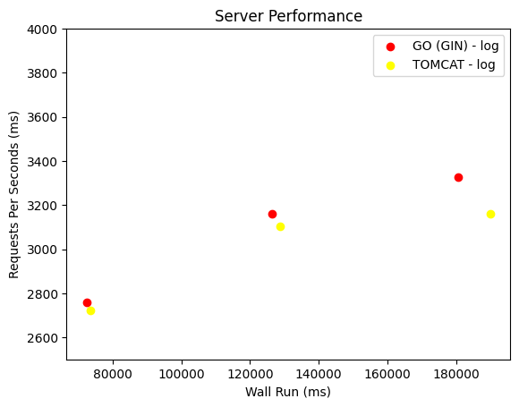
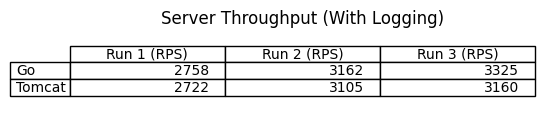
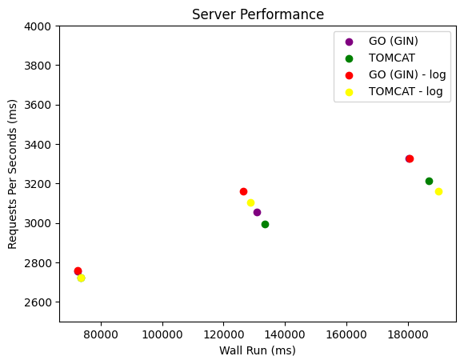
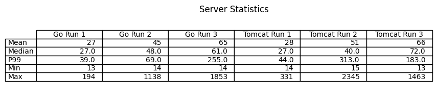

# CS6650 Homework 1 - Narrative

## 1. URL to the repo
- main repo
    - https://github.com/danielyhbi/cs6650-DistributedSystems/tree/main/homework1
- graphs (pdf)
    - https://github.com/danielyhbi/cs6650-DistributedSystems/blob/main/homework1/report/hw1_plot.pdf
- client part 1
    - https://github.com/danielyhbi/cs6650-DistributedSystems/tree/main/homework1/client
- client part 2
    - https://github.com/danielyhbi/cs6650-DistributedSystems/tree/main/homework1/client

## 2. description of my client design

For the server building, please refer to the ReadMe.md according github repo. **Since it is NOT required narrative, the server design is omitted in this submittal.**

>a 1-2 page description of your client design. ... whatever you need to convey concisely how your client works.

The java client is designed with concurrency in mind. It implemented several cuncurrenty features below:
- `Thread` (in the `JavaClient.java`): enable multi thread parallel processing
- `RequestWorker`: implements `Runnable` for the thread
- `CountdownLatch` (in the `JavaClient.java`): Syncronized way to keep track of the overall task progress
- `LinkedBlockingQueue` (in the `LogWriter.java`): thread-safe queue for producer (`RequestWorker`) and consumer (`LogWriter`)
- `LogWriter`: implements `Runnable` for a standalone thread that monitors queue and write anything to the csv file

Overall. The process follows:
1. `JavaClient` kicks start the process
    * `JavaClient` sends sample requests to warm up the server (_Step 2.2_ line 48 in `main()`)
    * `JavaClient` starts the load tests (as specified by the homework instruction, see results below) (_Step 2.3 and so on_, see line 58 in `main()`)
    * `JavaClient` initializes each thread that contains a RequestWorker (see `serverExecute()`)
2. `RequestWorker` package up the http requests (both POST + GET) and send it to the remote server (see `run()`)
    * `RequestWorker` listens to the http respond. Will retry up to (5) times if no HTTP-200 (see `OutputStream` in `run()`)
    * `RequestWorker` logs things by adding log info onto a `BlockingQueue`.

Meanwhile, `LogWriter` thread is listening to the `BlockingQueue`. If the queue is not empty, it will pull the data and write it into the specified .csv file through FileWriter. (see `run()` in `LogWriter.java`)

The csv files are processed in python. (see `hw1_plot.ipynb`)

## 3. Client (Part 1)

> A Plot showngthe throughput for the tests comparing teh two servers. This should also include a screen shot of your output window with your wall time and throughput for each of the 6 tests.

### Plot

### Tables
|Server|Run 1 (ms)| Run 2 (ms)| Run 3 (ms)|
|------|--------|-----|----|
| Go (Gin) | 72640 | 130910 | 180292 |
| Tomcat | 73486 | 133553 | 186682 |

## 4. Client (Part 2)

> run the client as per Part 1, showing the output window for each run with the specified performance statistics listed at the end, and a plot comparing the two servers.

### Plot

### Tables
|Server|Run 1 (ms)| Run 2 (ms)| Run 3 (ms)|
|------|--------|-----|----|
| Go (Gin) | 72505 | 126511 | 180478 |
| Tomcat | 73466 | 128814 | 189886 |

## 5. The plot of your throughput over time for a single test

## 6. Other graphs

There are a few more tables and graphs that I'm unsure if it should be shown or not. Please refer to `hw1_plot.pdf`